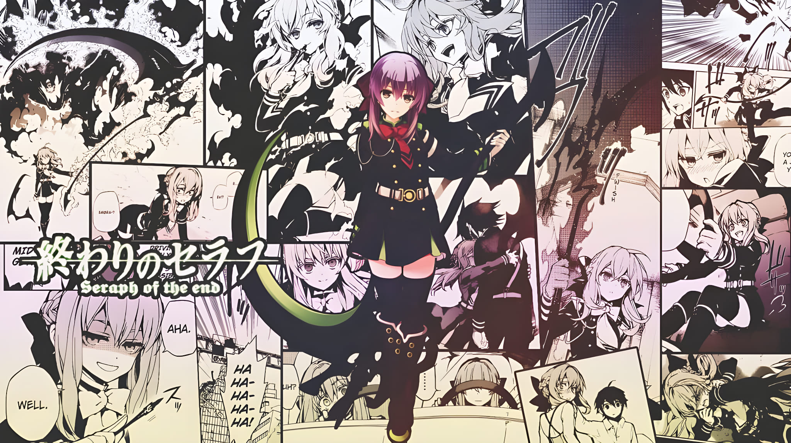
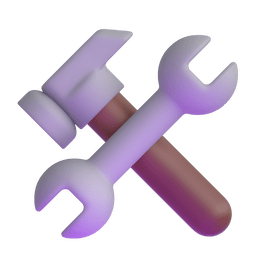

<div align="center">
  

  <h1> Hi, I'm Raol Mukarrozi</h1>
  <p>
    <strong>Full Stack Developer | Computer Science Student</strong><br>
    Bridging the gap between elegant frontend design and robust backend logic.<br>
    <em>Matcha fueled 🍵 & Cat cuddles 🐱</em>
  </p>

  <p style="margin-bottom: 8px;"><strong>Languages I Speak:</strong></p>
  

  <p style="margin-top: 15px; margin-bottom: 8px;">
     <strong>Workspace & Database:</strong>
  </p>
  

</div>

<div align="center">
  <h2>
    
    Wakatime Stats
  </h2>
</div>

<!--START_SECTION:waka-->

```txt
Total Time: 19 hrs 19 mins

JavaScript                         ⣿⣿⣿⣿⣿⣿⣿⣿⣿⣿⣿⣦⣀⣀⣀⣀⣀⣀⣀⣀⣀⣀⣀⣀⣀   46.19 %
HTML                               ⣿⣿⣿⣦⣀⣀⣀⣀⣀⣀⣀⣀⣀⣀⣀⣀⣀⣀⣀⣀⣀⣀⣀⣀⣀   14.04 %
YAML                               ⣿⣿⣿⣄⣀⣀⣀⣀⣀⣀⣀⣀⣀⣀⣀⣀⣀⣀⣀⣀⣀⣀⣀⣀⣀   12.83 %
JSON                               ⣿⣿⣷⣀⣀⣀⣀⣀⣀⣀⣀⣀⣀⣀⣀⣀⣀⣀⣀⣀⣀⣀⣀⣀⣀   11.41 %
CSS                                ⣿⣄⣀⣀⣀⣀⣀⣀⣀⣀⣀⣀⣀⣀⣀⣀⣀⣀⣀⣀⣀⣀⣀⣀⣀   04.58 %
Markdown                           ⣷⣀⣀⣀⣀⣀⣀⣀⣀⣀⣀⣀⣀⣀⣀⣀⣀⣀⣀⣀⣀⣀⣀⣀⣀   03.55 %
Docker                             ⣷⣀⣀⣀⣀⣀⣀⣀⣀⣀⣀⣀⣀⣀⣀⣀⣀⣀⣀⣀⣀⣀⣀⣀⣀   03.12 %
Bash                               ⣦⣀⣀⣀⣀⣀⣀⣀⣀⣀⣀⣀⣀⣀⣀⣀⣀⣀⣀⣀⣀⣀⣀⣀⣀   02.10 %
Git Config                         ⣄⣀⣀⣀⣀⣀⣀⣀⣀⣀⣀⣀⣀⣀⣀⣀⣀⣀⣀⣀⣀⣀⣀⣀⣀   00.91 %
Other                              ⣄⣀⣀⣀⣀⣀⣀⣀⣀⣀⣀⣀⣀⣀⣀⣀⣀⣀⣀⣀⣀⣀⣀⣀⣀   00.58 %
```

<!--END_SECTION:waka-->
